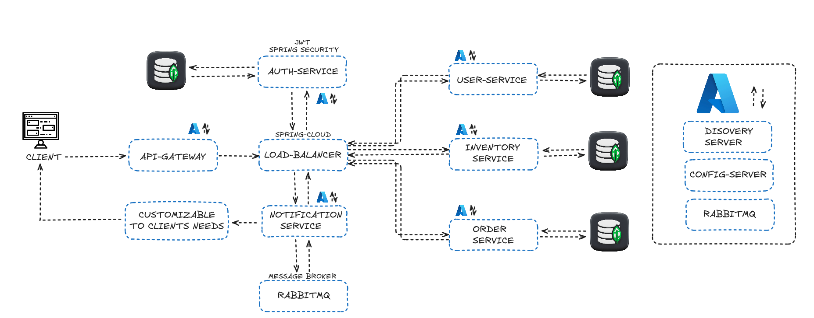

# Inventory Microservices Backend Monorepo with Java, Maven, and Spring Boot

## Table of Content
1. [Overview](#overview)
2. [Architecture](#architecture)
    - [Authentication Service](#authentication-service)
    - [Service Discovery](#service-discovery)
    - [API Gateway](#api-gateway)
    - [User Services](#user-services)
        - [Clients Service](#clients-service)
        - [Suppliers Service](#suppliers-service)
    - [Notification Service](#notification-service)
    - [Inventory Service](#inventory-service)
    - [Order Service](#order-service)
    - [Configuration Service](#configuration-service)
    - [Messaging Queue](#messaging-queue)
3. [Technologies and Dependencies](#technologies-and-dependencies)
    - [Java and Maven](#java-and-maven)
    - [Spring Framework](#spring-framework)
    - [Docker](#docker)
    - [Azure Integration](#azure-integration)
    - [Database](#database)
    - [Security and JWT](#security-and-jwt)
    - [Inter-Service Communication](#inter-service-communication)
    - [Logging and Tracing](#logging-and-tracing)
    - [Testing](#testing)
4. [Getting Started](#getting-started)
    - [Prerequisites](#prerequisites)
    - [Installation](#installation)
    - [Running the Services](#running-the-services)
    - [Running in Azure](#running-in-azure)
5. [Configuration](#configuration)
    - [Windows Setup](#windows-setup)
    - [Linux Setup](#linux-setup)
6. [CI/CD Pipeline](#ci-cd-pipeline)
    - [Azure Web App Pipeline](#azure-web-app-pipeline)
    - [Azure Spring Apps Pipeline](#azure-spring-apps-pipeline)
7. [Contributing](#contributing)
8. [License](#license)
9. [Contact Information](#contact-information)

## Overview

This project is a microservices-based monorepo built with Java, Maven, Docker, and Spring Boot. The application is designed to be highly scalable and resilient, using a variety of modern technologies and cloud services. The main components of the system include services for authentication, service discovery, API Gateway, user management (clients and suppliers), notifications, inventory, orders, and configuration. Additionally, the application leverages RabbitMQ for messaging, Zipkin for distributed tracing, and Feign for inter-service communication.

## Architecture

### Authentication Service
Handles user authentication and authorization using Spring Security and JWT.

### Service Discovery
Implemented using Netflix Eureka and deployed on Azure Spring Apps to facilitate service registration and discovery.

### API Gateway
Acts as the entry point to the microservices, routing requests to the appropriate service using load balancing.

### User Services
- Clients Service: Manages client-related operations and data.
- Suppliers Service:  Handles supplier-related operations and data.

### Notification Service
Responsible for sending notifications via various channels.

### Inventory Service
Manages inventory data and operations.

### Order Service
Handles the creation and management of orders.

### Configuration Service
Centralized configuration management deployed on Azure Spring Apps using Spring Cloud Config.

### Messaging Queue
RabbitMQ is used for asynchronous communication between microservices, deployed on Azure Containers.

## Technologies and Dependencies

### Java and Maven
- **Java:** Version 17
- **Maven:** Version 3.9.8

### Spring Framework
- **Spring Boot:** Version 3.3.0
- **Spring Security:** Version 6.3
- **Spring Cloud Netflix Eureka:** Version 4.1.2
- **Spring Cloud Config:** Version 2023.0.2
- **Spring Data MongoDB:** Version 4.3.3
- **Spring Cloud OpenFeign:** Version 4.1.3

### Docker
- **Docker Engine:** Version 25.0
- **Docker Compose:** Version 2.29.2

### Azure Integration
- **Azure Spring Apps**
- **Azure Container Instances**
- **Azure Pipelines**

### Database
- **MongoDB:** Version 8.0

### Security and JWT
- **JSON Web Tokens (JWT):** Used for securing the microservices.

### Inter-Service Communication
- **Feign Client:** For synchronous communication between microservices.

### Logging and Tracing
- **Zipkin:** Version 3.4.0 for distributed tracing.

### Testing
- **JUnit:** Version 5.10.0 for unit testing.
- **Mockito:** Version 5.5.0 for mocking in unit tests.

## Getting Started

### Prerequisites
- **Java 17**
- **Maven 3.9.8**
- **Docker**
- **Azure CLI**

### Installation
1. Clone the repository:
    ```bash
    git clone https://github.com/Sanchez1004/Inventory-Management-System-Microservices
    ```
2. Navigate to the project directory:
    ```bash
    cd Inventory-Management-System-Microservices
    ```
3. Build the project using Maven:
    ```bash
    mvn clean install
    ```

### Running the Services
- To start 'x' service locally using mvn & spring in the root directory. The first services that should be started are config-server then eureka-service, the last service needed to be started is the api-gateway:
    ```bash
  cd <service_directory>
  mvn clean install
  mvn spring-boot:run
    ```

### Running in Azure
- To deploy the services to Azure, follow the steps in the [Azure Spring Apps Pipeline](#azure-spring-apps-pipeline) section or deploy it one by one using Azure CLI. Maje sure to replace the <> with the respective names and paths:
  ```bash
  az login
  az group create --name <group_name> --location <location>
  az spring create --resource-group <group_name> --name <service_name>
  az spring app create --name <app_name> --resource-group <group_name> --service <service_name> --runtime-version Java_17 --memory 2Gi
  az spring app deployment create --name <deployment_name "green or blue following the azure recommendations"> --app <app_name> --resource-group <group_name> --service <service_name> --artifact-path <path_to_.jar_file> --jvm-options="-Xmx2g"
   ```

## Configuration

### Windows Setup
Instructions on setting up the project on a Windows environment.

### Linux Setup
Instructions on setting up the project on a Linux environment.

## CI/CD Pipeline

### Azure Web App Pipeline
Details on the pipeline configured for deploying a web app to Azure.

### Azure Spring Apps Pipeline
Details on the multi-repo pipeline for deploying microservices to Azure Spring Apps, maintaining consistent dependencies.

## Contributing
Guidelines on how to contribute to this project.

## License
This project is licensed under the MIT License.

## Contact Information
For any questions or support, please contact [your-email@example.com](mailto:your-email@example.com).
